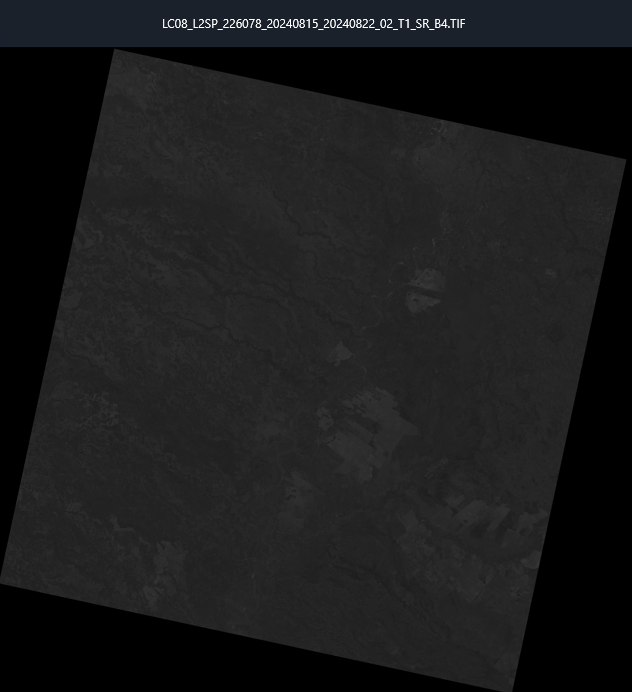
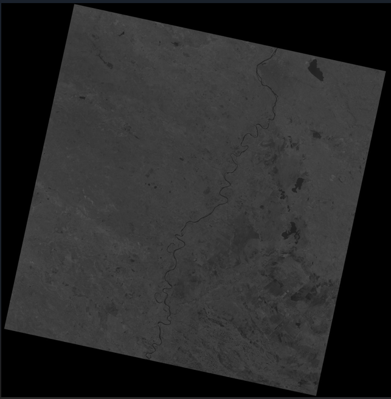
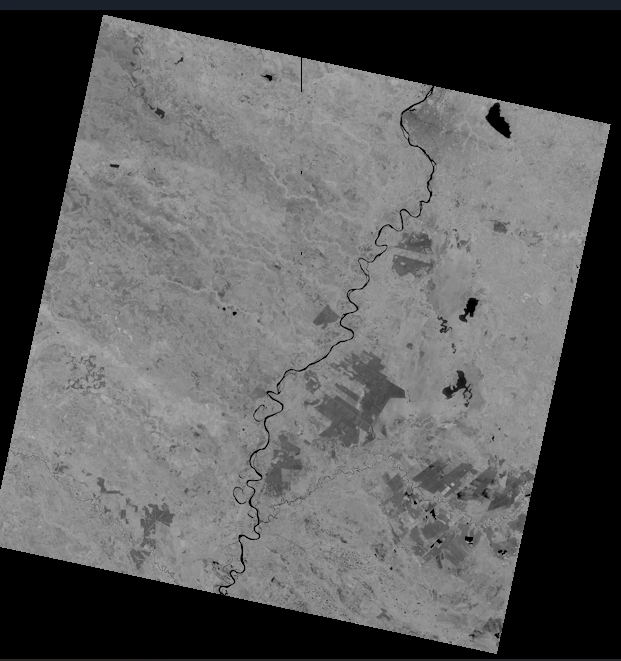
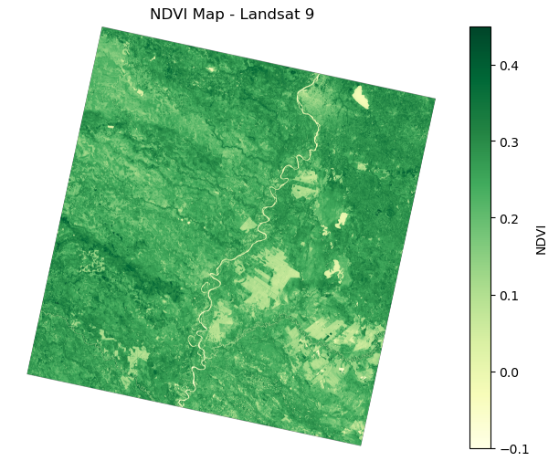
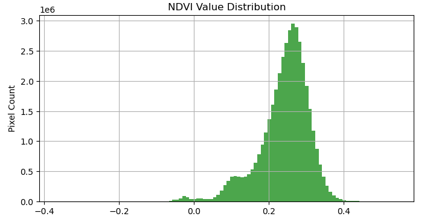

# Step 1: Create NDVI Raster From Satellite Images to Asunción

This step involved calculating the NDVI from Landsat 9 bands using Python. NDVI helps visualize vegetation health:

**Formula:** `(NIR - Red) / (NIR + Red)`

### Tools Used
- `rasterio`, `numpy`, `matplotlib`
- Landsat 9 data (Level 2, bands 4 and 5)

### Python Script
- [Create NVDI Raster](../Scripts/CreateNDVIRaster.ipynb)

### Screenshots
#### Landsat 9 Level 2 Infrared Raster Band 4

#### Landsat 9 Level 2 Near Infrared Raster Band 5

#### NDVI Raster Output:  (NIR - Red) / (NIR + Red)

#### Python Output: Asuncion is along River at very top of image

#### Used to Identify Outliers

### Notes
- NIR + Red = 0 for many values.  These were stored as 'Nan' so as not to skew the final output
