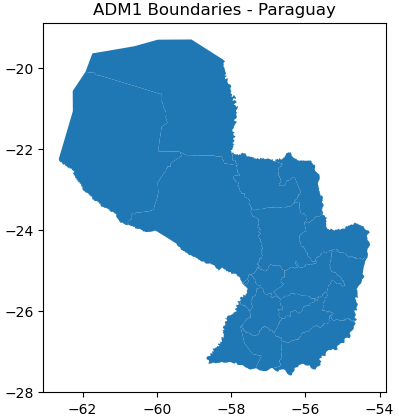
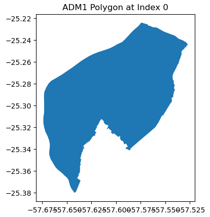
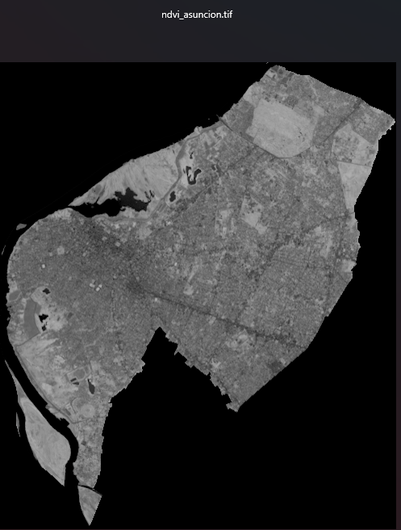

# Step 2: NDVI Raster Clipped to Asunción

This step involved manually clipping the full NDVI Raster using open source administrative boundary data and Python:

### Tools/Data Used
- `geopandas`, `matplotlib`, `rasterio` in Python
- Manual clipping with shapefile from Geoboundaries Data

### Custom Python Script
[SnipRaster](../Scripts/SnipRaster.ipynb)

### Screenshots from Python Script
#### Original Shapefile of Administrative Boundaries

#### Filtered for Asuncion Polygon

#### NDVI Image Clipped to Asuncion Polygon

### Clipped NDVI Image Output File

### Notes
- Image may appear pixelated due to small clipped area
