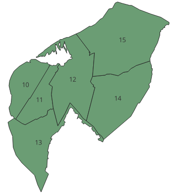
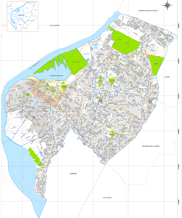

# Step 3: Custom Polygon Zones Digitized Manually

Since detailed barrio boundaries were unavailable, zones were digitized manually using a high-quality reference image.

### Tools/Data Used
- QGIS "Add Polygon" tool
- Scanned map reference overlaid beneath raster

### Screenshots
#### Custom Zones Created in QGIS

#### Reference Map

### Notes
- Reference Map was loaded into QGIS and custom polygons were created by tracing.
