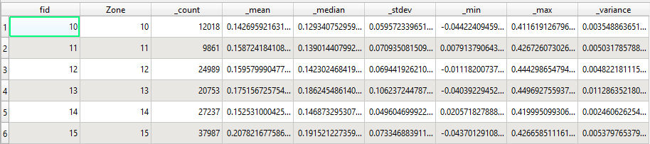

# Step 4: Zonal Statistics - NDVI Summary per Zone

Used QGIS Zonal Statistics plugin to calculate per-zone NDVI metrics.

### Statistics Calculated
- Mean NDVI
- Minimum and maximum NDVI
- Standard deviation
- Count of raster pixels per zone

### Tools/Data Used
- QGIS Zonal Statistics Plugin
- Custom drawn polygon zones

### Screenshots
#### Zonal Statitics Attribute Table

#### Custom Zones Layer

### Observations
- NDVI values ranged from ~0.11 to ~0.22 which makes sense given that it is city and not a dense forest.
