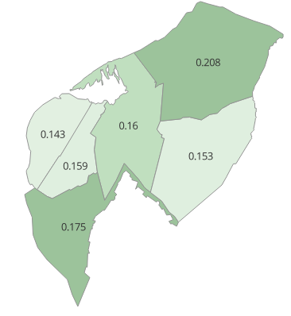

# Step 5: Styled Vector Map with Graduated Colors and Labels

Map styling was applied based on `ndvi_mean` using a color ramp.

### Tools/Data Used
- QGIS Symbology tab
- Graduated color ramp (White to Green)
- Labeling with expression builder (Round to 3 digits)

### Screenshots
#### Styled Zones

### Notes
- Adjusted gradient for small data range.  (The average means do not vary much)
