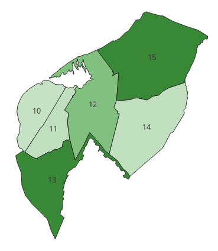
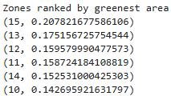
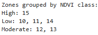

# Step 6: SQL Queries from Zonal Statistics CSV

After analysis in QGIS, the table was exported to CSV for use in further processing and SQL classification.

### Tools Used
1. SQLite3 and Pandas in Python
2. Zonal Statistics CSV file exported from QGIS

### Python Scripts
[SQL Queries](../Scripts/SQLqueries.ipynb)

### Screenshots
#### Styled Map By Zone Number

#### Zones Rearranged by Mean NDVI

#### Zones Classified into 3 Groups

### Notes
- Classification is arbitrary and relative to the levels of the input data.
- In reality these are all low NDVI values because Asuncion is mostly concrete and buildings and not trees.
