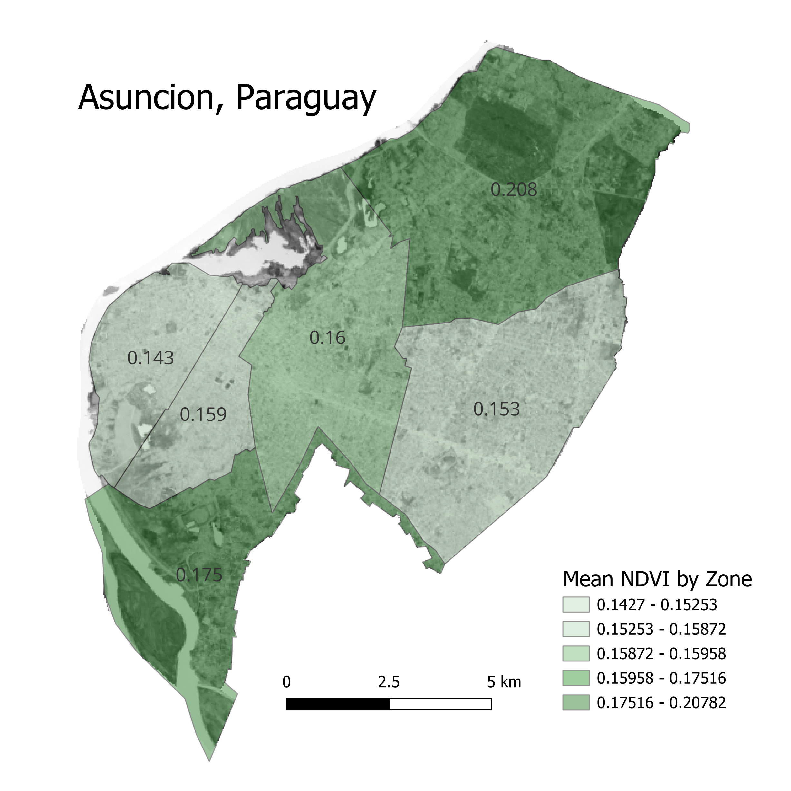

# Step 7: Final Map

The final map was created using Print Layout in QGIS and layering the styled zones over the clipped NDVI raster.

### Tools/Data Used
1. Print Layout in QGIS
2. Custom Styled Zones Layer
3. Clipped NDVI Raster Image

### Final map PDF
- [Final Map PDF](../Outputs/Mean_NDVI_by_Zone.pdf)

### Final High Quality PNG Export

